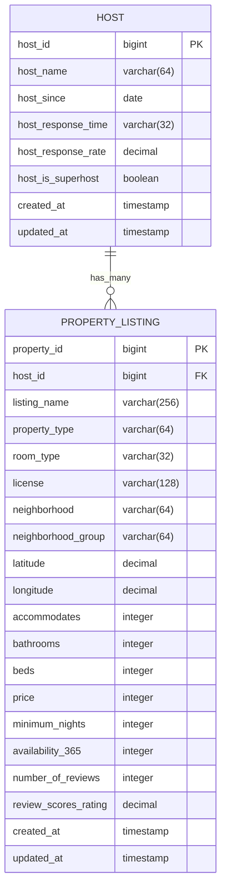

```mermaid
erDiagram
  HOST {
        host_id bigint PK
        host_name varchar(64)
        host_since date
        host_response_time varchar(32)
        host_response_rate decimal
        host_is_superhost boolean
        created_at timestamp
        updated_at timestamp
  }
  HOST ||--o{ PROPERTY_LISTING : has_many
  PROPERTY_LISTING {
        property_id bigint PK
        host_id bigint FK
        listing_name varchar(256)
        property_type varchar(64)
        room_type varchar(32)
        license varchar(128)
        neighborhood varchar(64)
        neighborhood_group varchar(64)
        latitude decimal
        longitude decimal
        accommodates integer
        bathrooms integer
        beds integer
        price integer
        minimum_nights integer
        availability_365 integer
        number_of_reviews integer
        review_scores_rating decimal
        created_at timestamp
        updated_at timestamp
  }

```